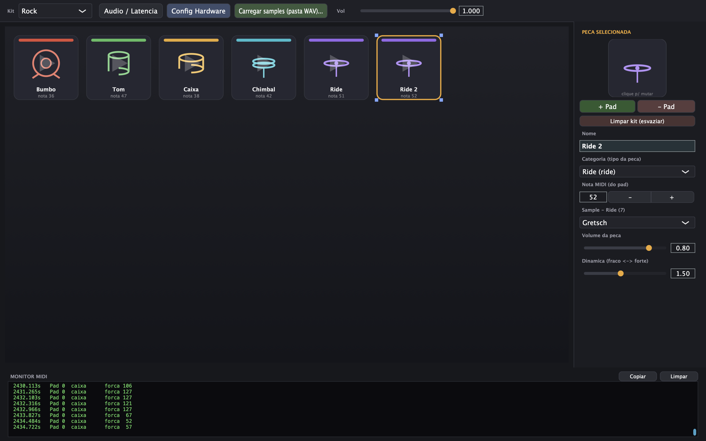

# FireKit

Software de bateria eletrônica que lê o controlador **[FireDrum](https://github.com/xFireHide/FireDrum)** (Arduino) direto pela porta serial e toca os sons na placa de áudio — **sem MIDI virtual e sem DAW**. Escrito em C++ com [JUCE](https://juce.com).



Substitui, num único processo, a corrente clássica do Windows
(**Hairless MIDI → loopMIDI → Addictive Drums → DAW**):

| Etapa tradicional | Aqui |
| --- | --- |
| Hairless (serial → MIDI) | `SerialAudioBridge` — lê a serial e decodifica MIDI |
| loopMIDI (porta virtual) | `LockFreeQueue` — mesma memória, sem syscall |
| Addictive Drums (sampler) | `DrumSampler` + `SampleBank` |
| DAW (host + áudio) | `AudioEngine` — fala direto com a placa de som |

Resultado: **serial → som** num processo só, com latência mínima.

## Compilar e rodar

Requisitos: `cmake` ≥ 3.22 e um compilador C++20. O JUCE 8 é baixado automaticamente na 1ª configuração (precisa de rede).

```bash
cmake -B build -DCMAKE_BUILD_TYPE=Release
cmake --build build --parallel
```

O app fica em `build/FireKit_artefacts/Release/`.

## Hardware

A porta serial e o baud ficam em `Source/Main.cpp` (`/dev/cu.usbserial-...`, 115200). Descubra a sua:

```bash
ls /dev/cu.usbserial-* /dev/cu.usbmodem-* 2>/dev/null
```

A sensibilidade de cada pad (força da batida → volume) é calibrada no painel **Config Hardware** e gravada na EEPROM da própria placa.

## Interface

- **Kits e samples** por peça (WAV ou kit sintético embutido)
- **Config Hardware** — sensibilidade, threshold e nota de cada pad físico
- **Dinâmica** por peça (curva força → volume) + volume master
- **Monitor MIDI** — cada batida como `Pad N`, com scroll e botão copiar
- Pads piscam no hit (brilho ∝ força)

## Problemas comuns

- **Porta não aparece** em `/dev/cu.*`: quase sempre cabo *charge-only* — troque o cabo.
- **Conecta mas sem som**: confira a porta e o baud em `Main.cpp`, e feche o Serial Monitor do Arduino (só um app pode abrir a porta).
